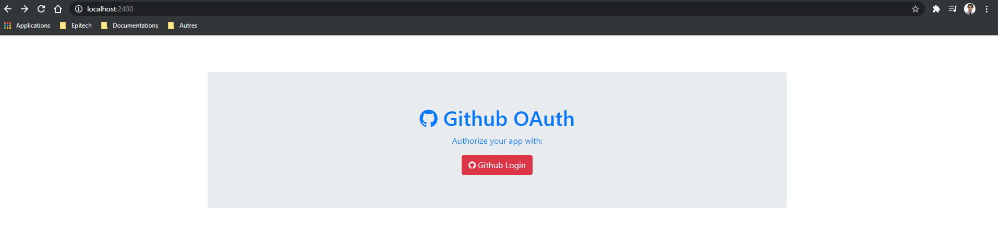

## Requirements

To implement your own Github Auth you need to register a new application in Github OAuth Apps. (https://github.com/settings/applications/new)
You need to fill all the required details and put the Authorization callback URL as http://localhost:PORT/github/callback.
Once you register the application you will get the App's Client Id and Secret which you need to use in your code.

## Dependances

```bash
npm install express ejs axios --save
```
## Usage

```bash
npm start
```

## Screenshot




